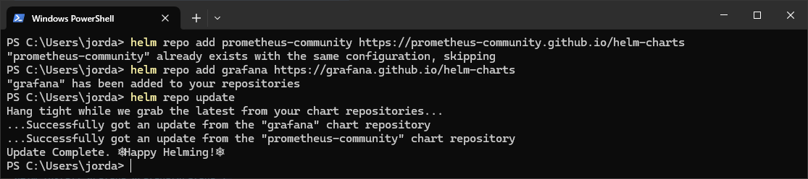
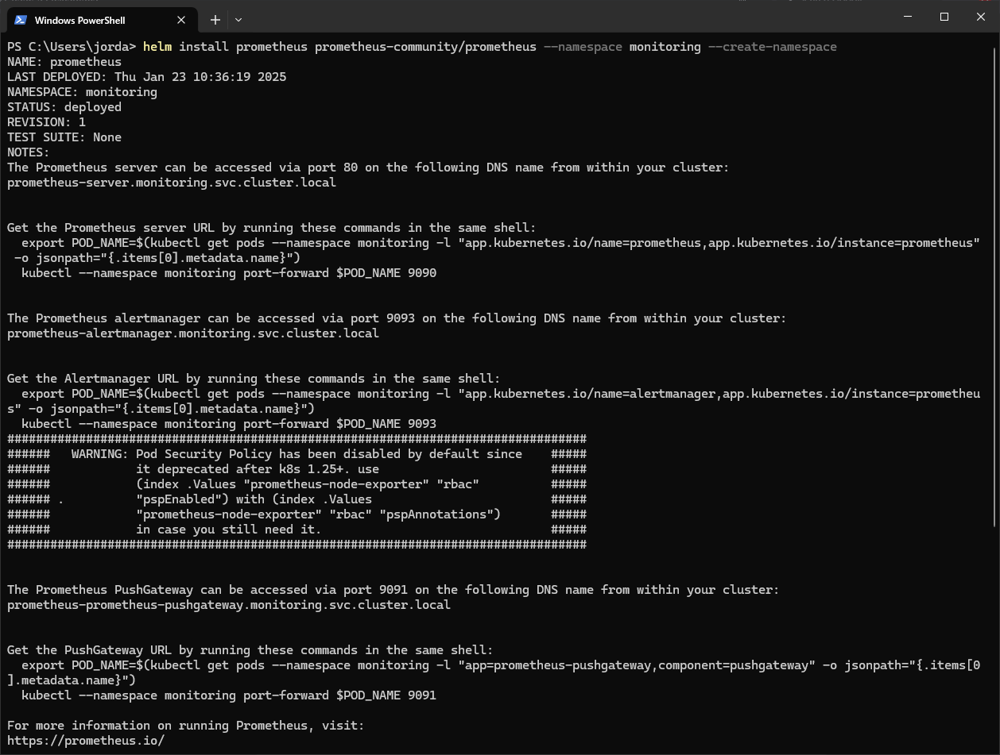
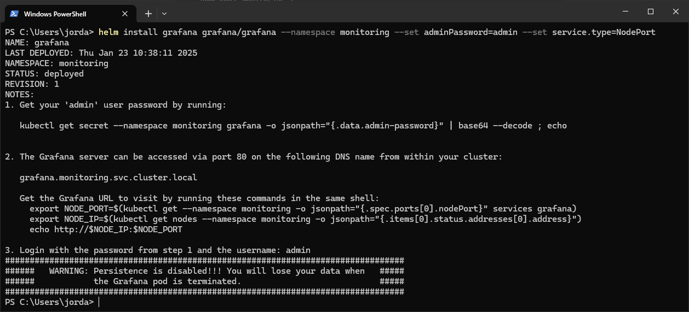
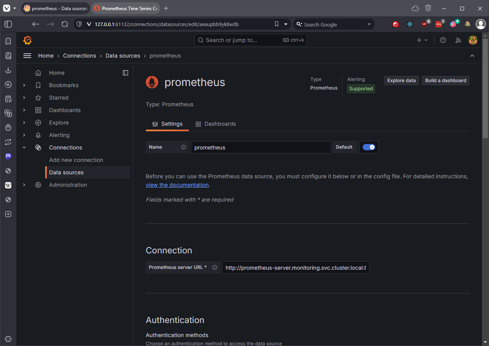
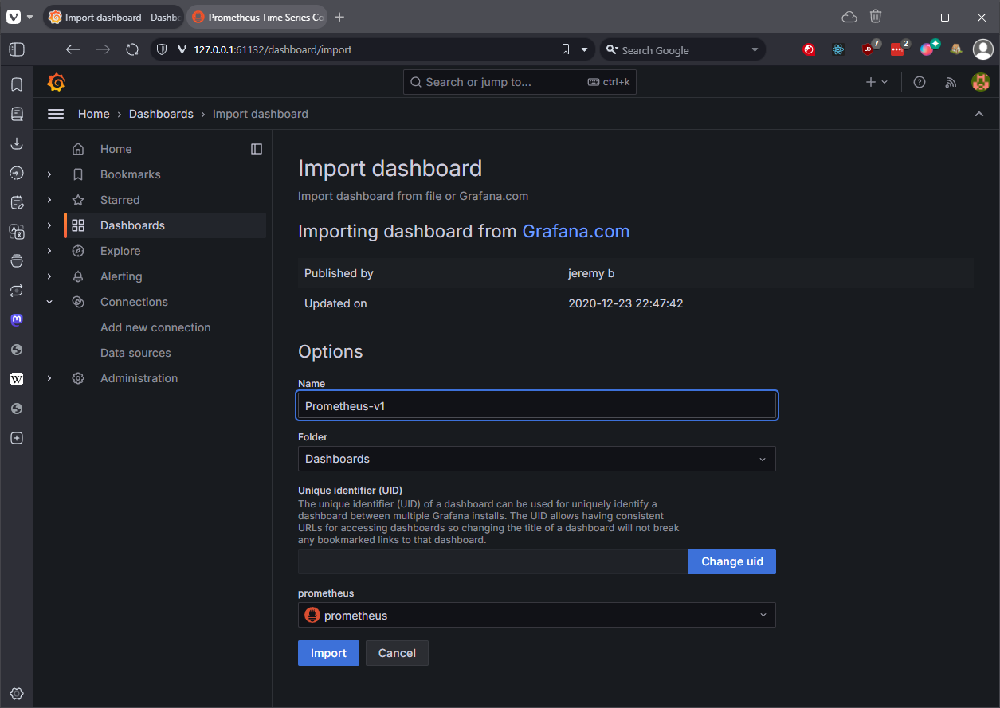

# Setting up Prometheus and Grafana

## My Thoughts
- As usual, Chocolatey is a great way to install CLI tools on Windows. Make sure you're in Administrator mode.
- Helm is a package manager for Kubernetes, simple.
- Adjust the suggested steps for setting up Grafana to whatever terminal you're using, the default ones they suggest are for Linux.
- Default username and password for Grafana is `admin`, it will prompt you to change this after first login.
- Having a slight issue getting Grafana to open on the Node IP, but i'm just running it on localhost for now.
- Remember, Grafana and Prometheus are in the same cluster, access them via the provided address and in this instance, port 80.

## Prerequisites
- Ensure Minikube is running.
- Install Helm: [Helm Installation Guide](https://helm.sh/docs/intro/install/)

## Steps

### 1. Add Prometheus and Grafana Helm Repositories
```bash
helm repo add prometheus-community https://prometheus-community.github.io/helm-charts
helm repo add grafana https://grafana.github.io/helm-charts
helm repo update
```


### 2. Deploy Prometheus Using Helm
```bash
helm install prometheus prometheus-community/prometheus --namespace monitoring --create-namespace
```



### 3. Deploy Grafana Using Helm
```bash
helm install grafana grafana/grafana --namespace monitoring --set adminPassword=admin --set service.type=NodePort
```


### 4. Access Grafana
Get the NodePort for Grafana:
```bash
kubectl get svc -n monitoring
```
Visit Grafana at `http://<minikube-ip>:<nodeport>`.

### 5. Access Grafana with localhost
Alternatively you can access from localhost on minikube:
```bash
minikube service grafana -n monitoring --url
```
This command will provide a direct URL that you can use to access Grafana.

## 6. Add Prometheus as a Grafana data source (in the Grafana UI).

Connections, Add new connection, Prometheus, http://prometheus-server.monitoring.svc.cluster.local:80



## 7. Add a Dashboard

Dashboards, Import, enter a Dashboard URL, Add prometheus as data source.

