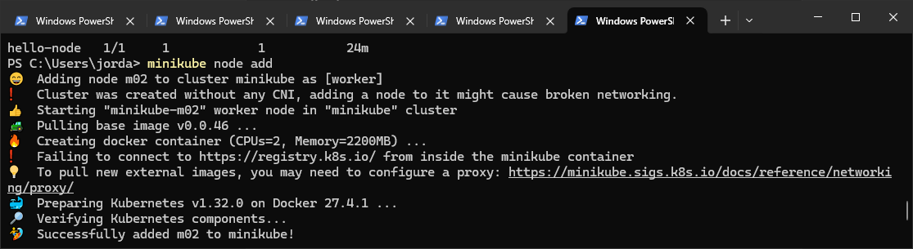
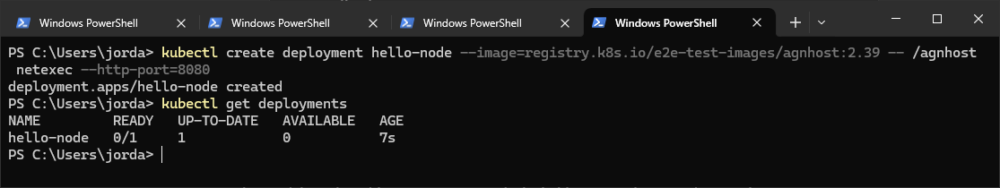
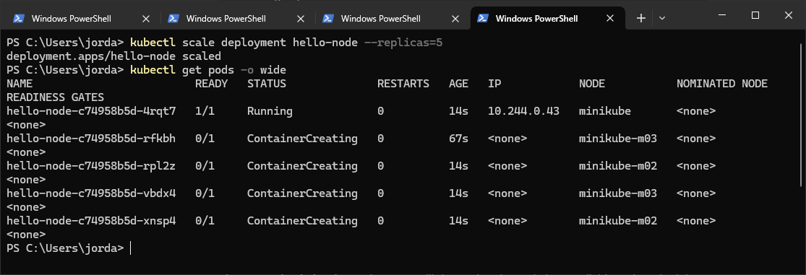

# Some Basic monitoring with Minikube

## My Thoughts
- It's great to be able to just scale up and down the number of pods, and see how they're distributed across the nodes.
- It's also great to be able to see the logs for the pods, and see what's happening.
- Prometheus provides more than enough data out of the box for minikube.
- It's fun to scale them up and down on the CLI, but next I will move onto Chaos Engineering.

## Steps

### 1. Add some nodes

Repeat this a couple of times to add more nodes to the cluster:

```bash
minikube node add
```


### 2. Deploy a sample application

This is an example deployment from the Kubernetes docs:

```bash
kubectl create deployment hello-node --image=registry.k8s.io/e2e-test-images/agnhost:2.39 -- /agnhost netexec --http-port=8080
```




## 3. Scale the deployment

Scale the deployment to 5 replicas, spread accross the nodes:

```bash
kubectl scale deployment hello-node --replicas=5
```

## 4. Check the deployment

Check how the pods are distributed across the nodes:

```bash
kubectl get pods -o wide
```


## 5. Test how the deployment reacts to a Pod Kill

Simulate killing a pod to see if Kubernetes reschedules it

```bash
kubectl get pods -o wide
```


