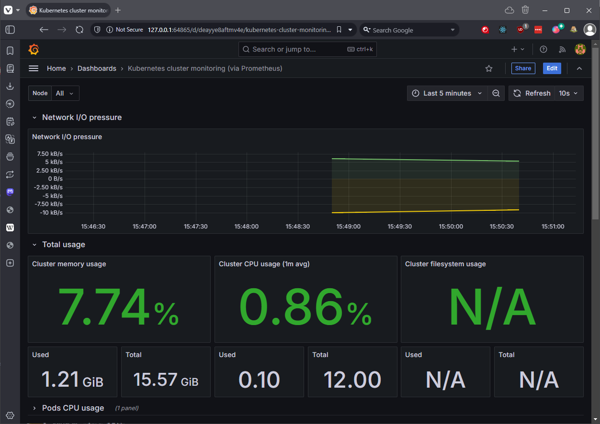
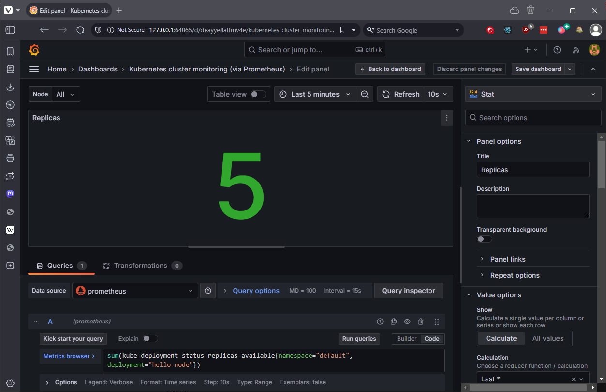
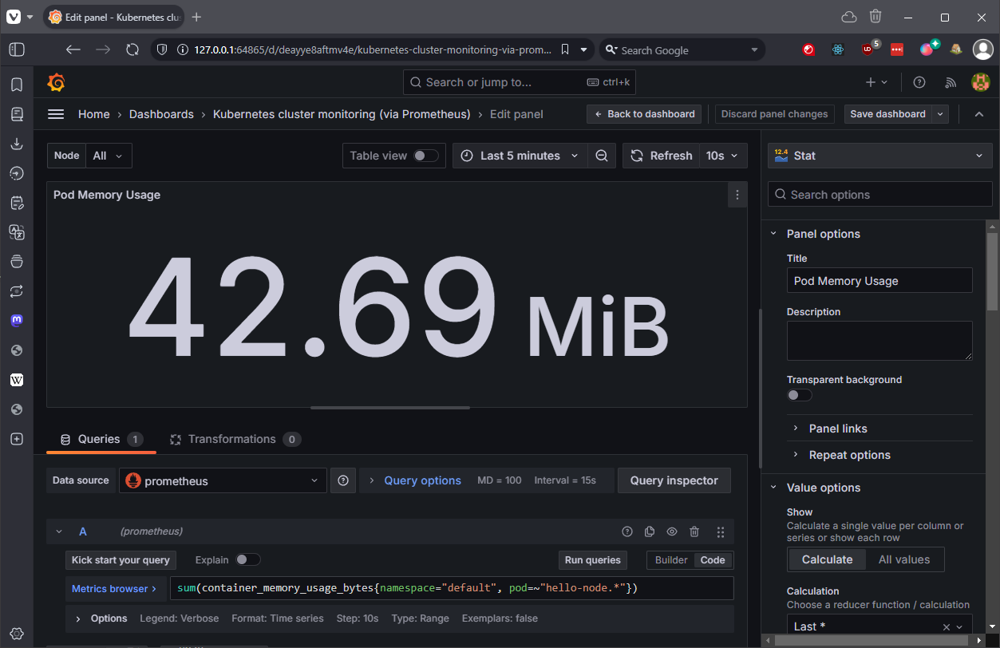
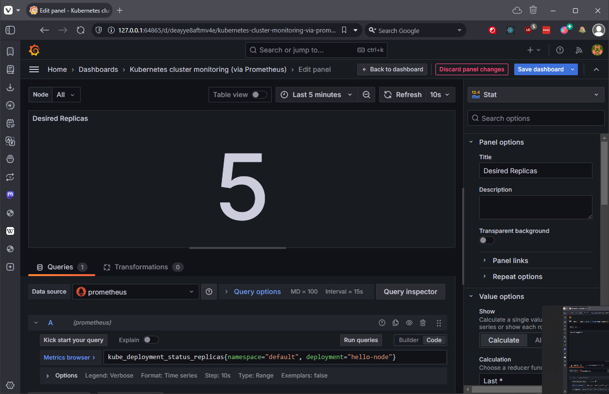
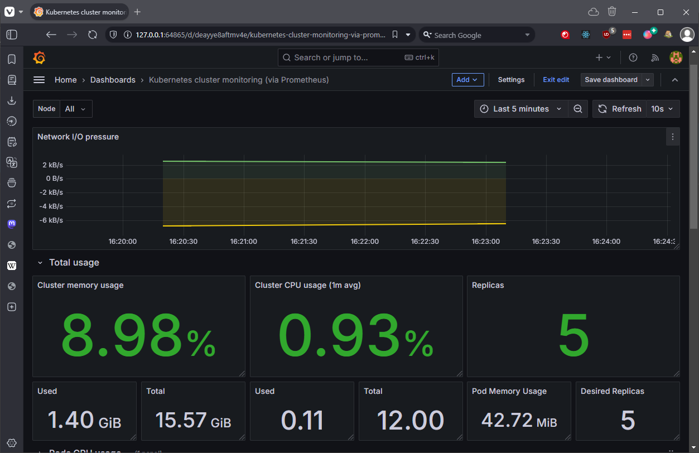

# Grafana Dashboard setup

## My Thoughts

- Lets keep this really simple, minikube is limited in scope, and I'm just using a single node for this exercise.
- I'm using the a prebuilt dashboard, but I'll be tweaking it a bit to get the data I need.
- It's a good exercise in using PromQL, which is very intuitive and easy to use.
- I'm using my deployment from step 3, it's called hello-node and it's in the default namespace.

## Steps

### 1. Default Dashboard

- This is basic dashboard designed for monitoring the Kubernetes cluster (ID #1621). It's a good starting point, but for minikube lets tune it a bit.



### 2. Add a Pod Replica Count

- This will tell us the number of pods available, and we can scale up and down to see how it behaves. I'll be using basic PromQL queries to get the data out of the dashboard.
- We're using the hello-node deployment from the previous exercise.
- Edit whatever part of the dashboard you like, I'm using the filesystem panel. Modify the selection on the right handle panel to get it formatting correctly (as a number rather than a percentage, for example).

```bash
sum(kube_deployment_status_replicas_available{namespace="default", deployment="hello-node"})
```



### 3. Add a Pod Memory Usage

- As above, but for the memory usage of the pods.

```bash
sum(container_memory_usage_bytes{namespace="default", pod=~"hello-node.*"})

```




## 4. Show Desired Replica Count

- This will show the desired number of replicas for the deployment, a mismatch between the actual number of pods and the desired number of replicas will cause the pods to be rescheduled.

```bash
kube_deployment_status_replicas{namespace="default", deployment="hello-node"}
```



## 5. Final Minimal Dashboard

- This is the dashboard I'm using for my minikube cluster.
- It should show us plenty for some basic monitoring, will see if I'll need to add more when we do some Chaos Engineering...



