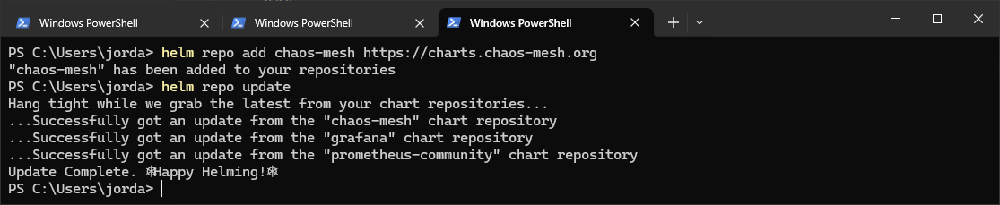
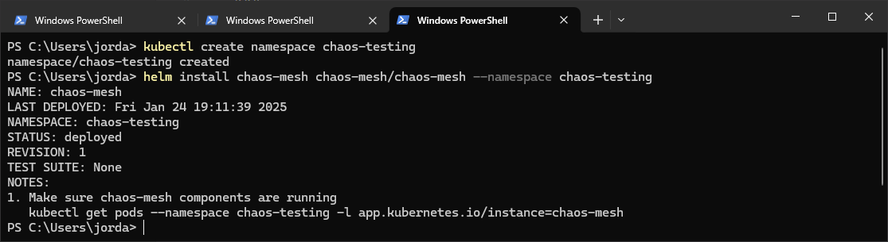
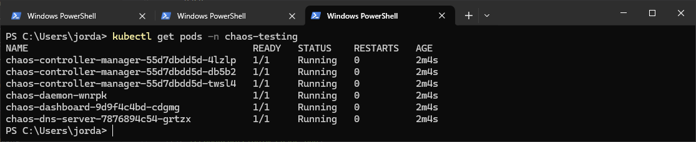
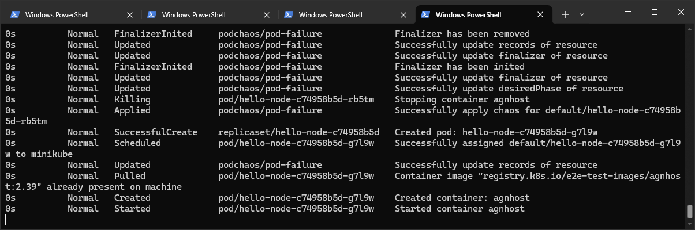

# Chaos Engineering

## My Thoughts

- This is so fun, I really like how these tools work together, it's so easy with helm charts.
- I can really see the benefit of using these to test systems, and the yaml files are super easy as always.

## Steps

### 1. Add the Chaos Mesh Helm Repository

``` bash
helm repo add chaos-mesh https://charts.chaos-mesh.org
helm repo update
```


### 2. Make a new namespace for the chaos mesh, install using helm

``` bash
kubectl create namespace chaos-testing
helm install chaos-mesh chaos-mesh/chaos-mesh --namespace chaos-testing
```


### 3. Verify the chaos mesh is running

``` bash
kubectl get pods -n chaos-testing
```


### 4. Access the dashboard

- You can use the dashboard for managment and visulation of your experiments, forward the port then access at http://localhost:2333
- Follow the instructions to create your key, it involves generating a yaml file, and then applying it to the cluster.

```bash
kubectl port-forward -n chaos-testing deployment/chaos-dashboard 2333:80
```

### 5. Our First Experiment

- I'm going to make the simplest thing I could think of, a pod kill.
- In the root of this repo, there's a pod-chaos.yaml file, this describes the experiment.
- Since kubernetes replaces the pods almost instantly, Grafana won't really be able to show us what's happened. However you can run the following command in your terminal to track what's going on in the cluster live:

```bash
kubectl get events --namespace=default --watch
```

- Make sure you have you keep an eye on this when you apply the experiment! Make sure you're in the right directory in your terminal, and apply the experiment using the following command:

```bash
kubectl apply -f pod-chaos.yaml
```

- You should see the following output, almost instantly:

