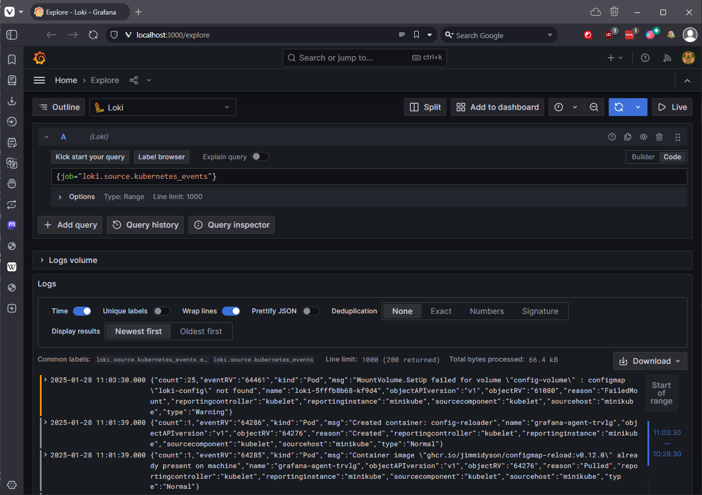
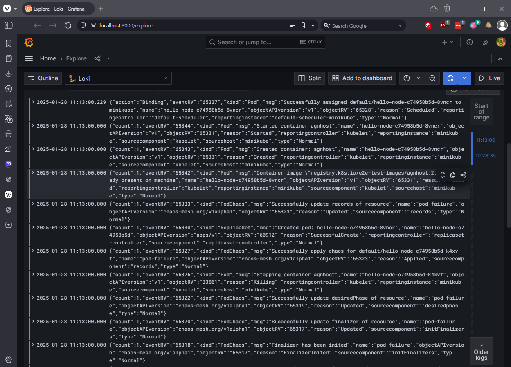
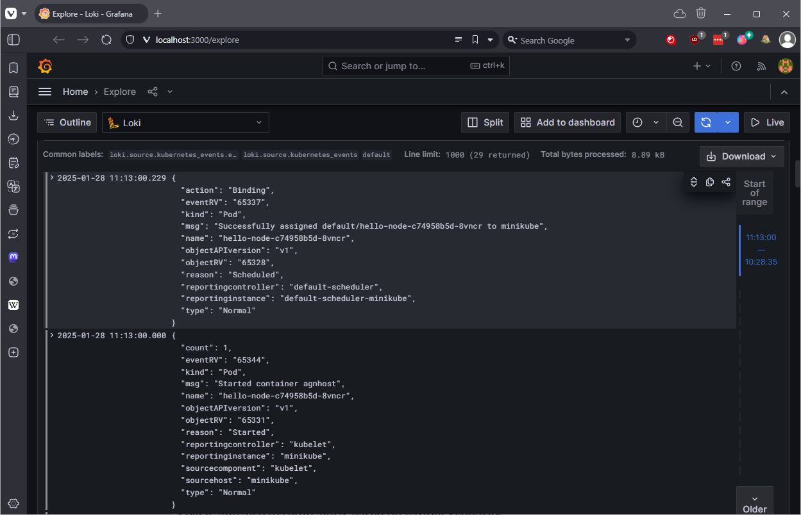

# Deploying the Loki Stack

## My Thoughts

- E(Elasticsearch), F(Fluentd), K(Kibana) is a common stack for logging, but it's just too chunky to deploy on minikube.
- I'm going to use the Loki Stack, which is a bit more lightweight, but still provides the a decent logging stack.
- This is only the start really, next I'm going to setup alerts.

## Steps

### 1. Add the Grafana Helm Repository (you likely already have this)

``` bash
helm repo add grafana https://grafana.github.io/helm-charts
helm repo update
```

### 2. Helm values file for the Loki Stack

- This helps us tune this a little to make it play nice with minikube. Call it loki-stack-values.yaml

``` yaml
loki:
  enabled: true
  size: 1Gi
promtail:
  enabled: true
grafana:
  enabled: true
  sidecar:
    datasources:
      enabled: true
```

### 3. Deploy the Loki Stack

- This command will deploy the Loki Stack to minikube, with the values from loki-stack-values.yaml.
- It will also deploy Grafana and Promtail, which are the components that actually do the logging.

``` bash
helm upgrade --install loki --namespace=monitoring grafana/loki-stack --values loki-stack-values.yaml
```
### 4. Let's setup Grafana-Agent

- Make a values file like before for Grafana-Agent, but call it grafana-agent-values.yaml

```yaml
agent:
  # -- Mode to run Grafana Agent in. Can be "flow" or "static".
  mode: 'flow'
  configMap:
    # -- Create a new ConfigMap for the config file.
    create: true
    # -- Content to assign to the new ConfigMap.  This is passed into `tpl` allowing for templating from values.
    content: |
      
      logging {
        level  = "info"
        format = "logfmt"
      }

      loki.source.kubernetes_events "events" {
        log_format = "json"
        forward_to = [loki.write.loki_endpoint.receiver]
      }

      loki.write "loki_endpoint" {
        endpoint {
          url = "http://loki.monitoring:3100/loki/api/v1/push"
        }
      }
```

- Update the repo and deploy Grafana-Agent with the chart

``` bash
helm repo update
helm upgrade --install grafana-agent --namespace=monitoring grafana/grafana-agent --values grafana-agent-values.yaml
```

### 5. Access the Grafana UI

``` bash
kubectl port-forward svc/loki-grafana 3000:80 -n monitoring
```

- Get the admin password from the secret, this is how to do it in powershell, bash is slightly different

``` powershell
kubectl get secret loki-grafana -n monitoring -o jsonpath="{.data.admin-password}" | ForEach-Object { [System.Text.Encoding]::UTF8.GetString([Convert]::FromBase64String($_)) }
```

- Open a browser and go to http://localhost:3000, and login with the username admin and the password you got from the previous command.

### 6. Accessing the logs

- Go to the Explore tab and run

```bash
{job="loki.source.kubernetes_events"}
```

- It should look something like this:



### 7. Accessing logs for a namespace

- You can really simply access logs for a namespace by running:

```bash
{namespace="default"}
```

- This accesses logs from the default namespace. I've still got this setup from earlier, so you can really clearly see the logs from our pod deletion experiment.



- If that hurts your eyes a little, you can change to Prettify JSON on the slider above the logs:

