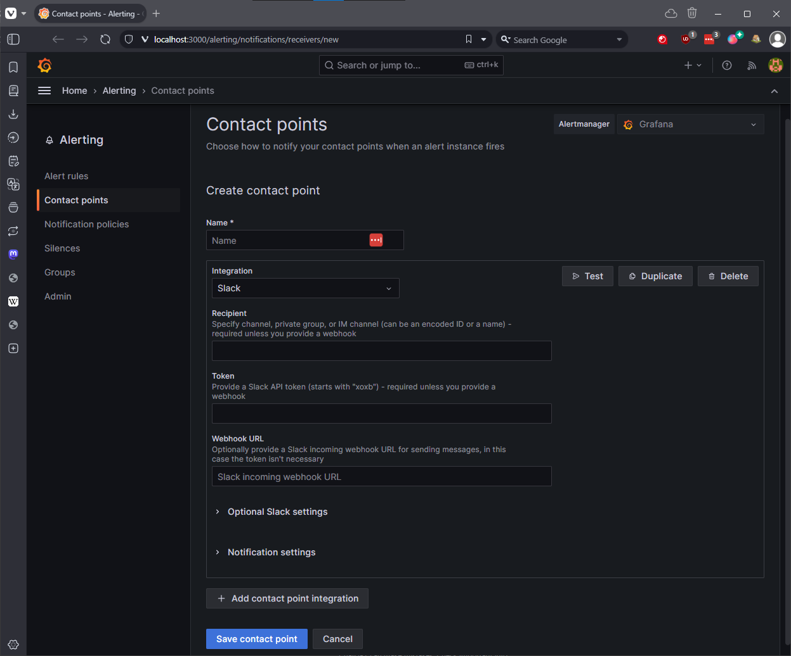
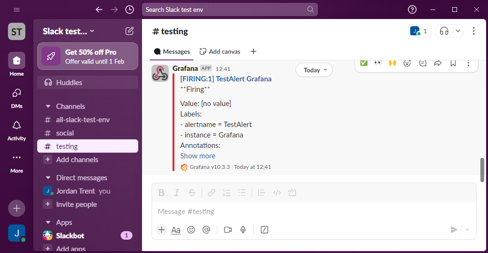
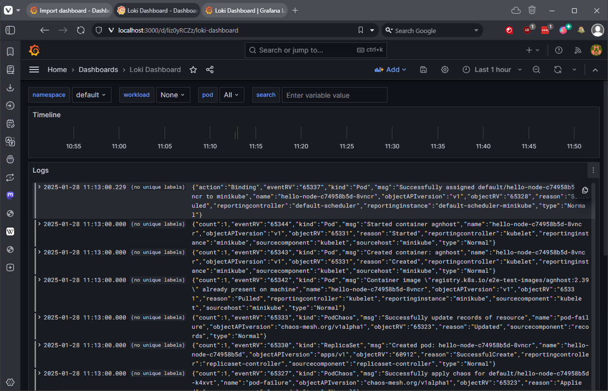
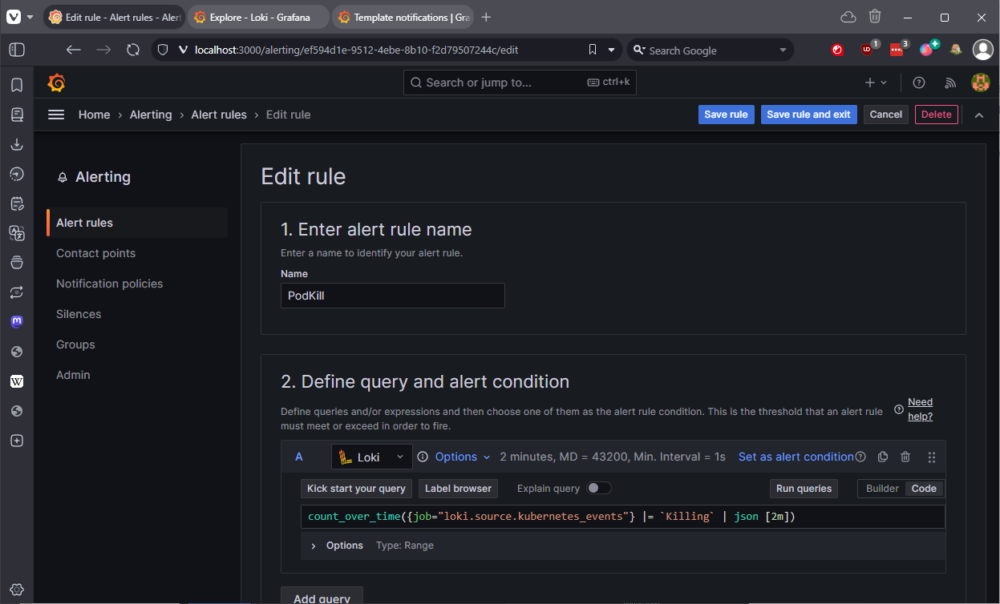
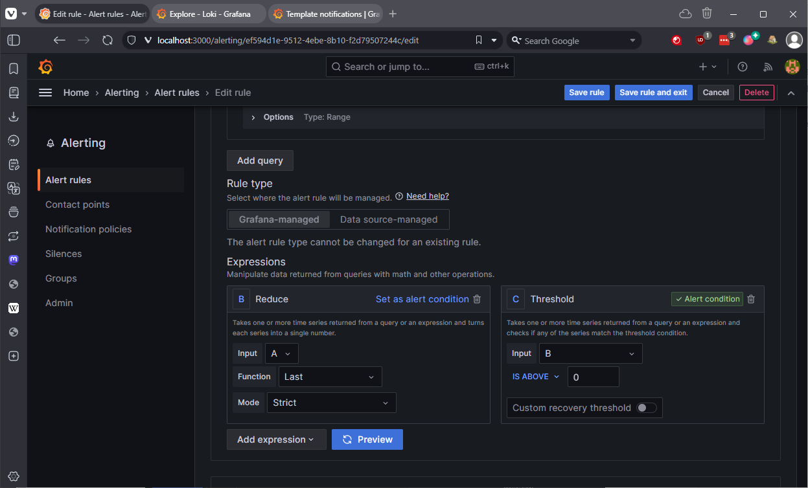
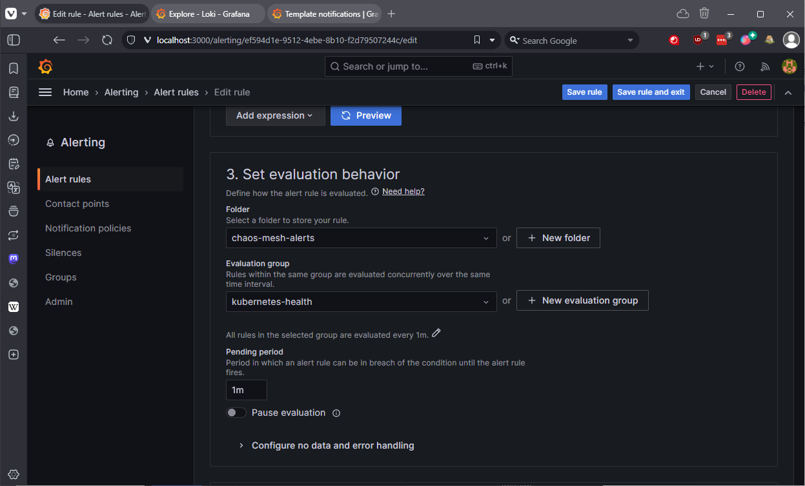
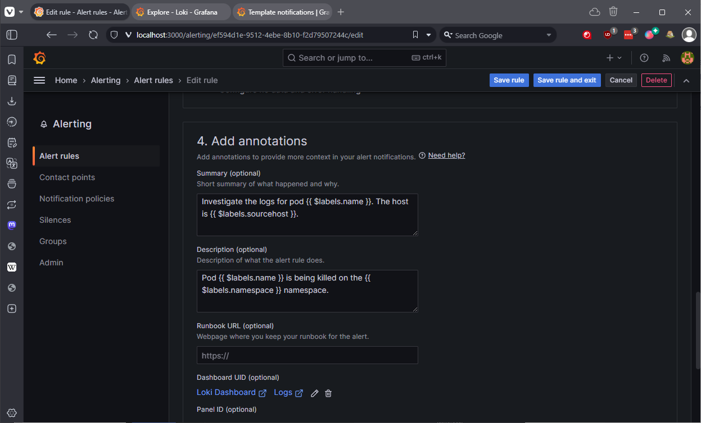
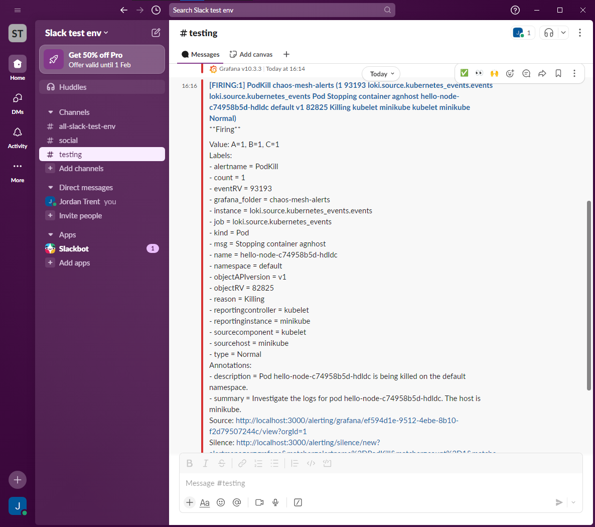
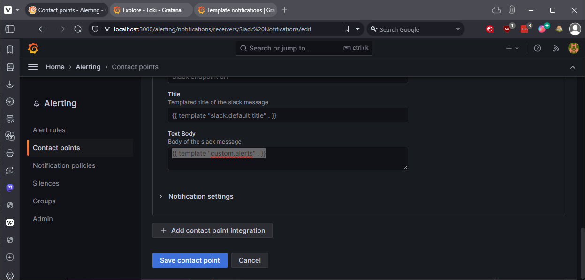
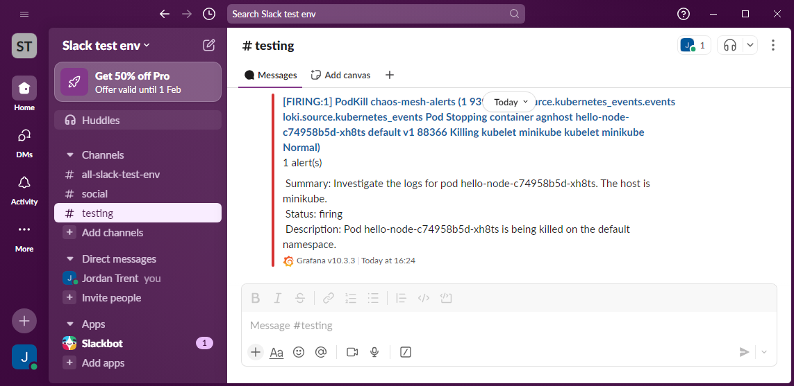

# Setting up Alerts

## My Thoughts

- Grafana comes with some great alerting functionality out of the box.
- Loki is a great tool, I like how easy the Json parser is to use and adapt.
- These are very simple tests, but this is a great starting point to build from.

## Steps

### 1. Setup Slack

- I'm not going to go into too much detail here, I've put a test channel together in slack and added the incoming webhook integration.
- Go to Settings & Administration, Manage Apps, add Incoming Webhooks and follow the steps. Save the URL for later.

### 2. Add Slack as a Contact Point in Grafana

- Go to Alerting, Notifications, and add a new contact point, Slack.
- Enter a name, the Webhook URL you got from Slack. You don't need to fill the other fields as this is provided by Slack via thre Webhook.



- Click test, you should see a message in Slack.




### 2. Access your Grafana Dashboard, and setup a dashboard for Loki

- I'm importing a dashboard as before, it actually consumes both Loki data and Prometheus which is really cool. It's #13186



- You can easily fiddle with the dashboard along the top there to see how it works.

### 3. Create a new alert rule

- Go to Alerting, Alert Rules and create a new rule. I've chosen the following query, which will count the instances of "Killing" in the logs over 2 minutes.

```bash
count_over_time({job="loki.source.kubernetes_events"} |= `Killing` | json [2m])
```



- The alert counts how many times it appears over 2 minutes, and will alert if it's one or greater.



- This is how I'm choosing to evaluate, I might change this later.



- Finally, this is where we put to use the Json parser that we had on our query earlier. It turns each field into a label for us to use here, then we can provide dynamic data.



### 4. Test the alert

- I'm testing the alert using Chaos Mesh, because that's what I designed this for. Use the previous PodKill script, if everything is set correctly, you will get an alert in Slack.

```bash
kubect delete -f pod-chaos.yaml ## If you forgot to clean up last time
kubectl apply -f pod-chaos.yaml
```

- As you can see, after a short time the alert will be triggered, and you'll get this rather ugly default message in Slack:



### 5. Customize the alert with a Notification Template

- To fix this and make it easier to digest, I'm going to use a Notification Template.
- Go to Alerting, Contact Points, and choose Notification Templates.
- This is a template designed to parse the alert itself, using the labels defined in the alert.
- Call it custom.alerts

```go
{{ define "custom.alerts" -}}
{{ len .Alerts }} alert(s)
{{ range .Alerts -}}
  {{ template "alert.summary_and_description" . -}}
{{ end -}}
{{ end -}}
{{ define "alert.summary_and_description" }}
  Summary: {{.Annotations.summary}}
  Status: {{ .Status }}
  Description: {{.Annotations.description}}
{{ end -}}
```

- No go back to contact points and edit the Slack contact point, on optional Slack settings change the 



### 6. Test the alert again

```bash
kubect delete -f pod-chaos.yaml ## If you forgot to clean up last time
kubectl apply -f pod-chaos.yaml
```

- What you'll see is much more readable, we aren't trying to fix the problem in Slack anyway, it's just pointing us in the right direction to go and look deeper in the Logs, whether that's in Loki or use kubectl.

