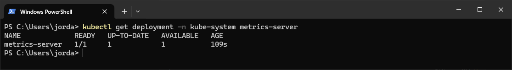
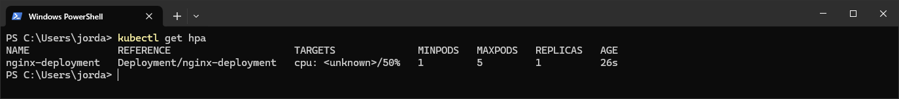
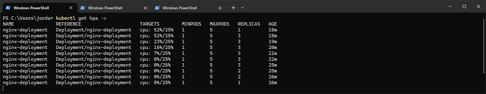

# Setting up Autoscaling

## My Thoughts

- Scaling Horizontally is when you add more pods, and that in turn increases availability.
- Scaling Vertically is when you increase the amount of hardware resources to suit the load.
- Both can be used to manage increased load/traffic, but horizontal tends to be favoured as it in turn makes the system mroe resillient to failures and improves experience at edge locations for example.
- Again, this is pretty basic, but these are solid concepts and it's always good to get down to the nuts and bolts of how these things work.

## Steps

### 1. Enabling Metrics Server

- This is required for Horizontal Pod Autoscaler to work.

```bash
minikube addons enable metrics-server
```

- Check it's running

```bash
kubectl get deployment -n kube-system metrics-server
```



### 2. Sample App Deployment

- A simple Nginx deployment, that we can use with HPA

```yaml
apiVersion: apps/v1
kind: Deployment
metadata:
  name: nginx-deployment
spec:
  replicas: 1
  selector:
    matchLabels:
      app: nginx
  template:
    metadata:
      labels:
        app: nginx
    spec:
      containers:
      - name: nginx
        image: nginx
        resources:
          requests:
            cpu: "100m"
          limits:
            cpu: "500m"
```

- Apply the yaml

```bash
kubectl apply -f nginx-app.yaml
```

### 3. Create the HPA

- 25% would be the threshold for scaling here, that's quite low, but it makes testing easier since I'm not putting a huge load on. Min and max refer to pods.

```bash
kubectl autoscale deployment nginx-deployment --cpu-percent=25 --min=1 --max=5
```

- Check the status of the HPA

```bash
kubectl get hpa
```



- Expose the service so we can access it with our load generator

```bash
kubectl expose deployment nginx-deployment --port=80 --target-port=80 --type=ClusterIP
```

- Put some load on the deployment, I'm using powershell, bash is slightly different

```powershell
kubectl run -it --rm --image=busybox load-generator -- sh -c "while true; do wget -q -O- http://nginx-deployment.default.svc.cluster.local; done"
```

- In another terminal, run the following command to see how the HPA is working

```bash
watch kubectl get hpa -w
```



