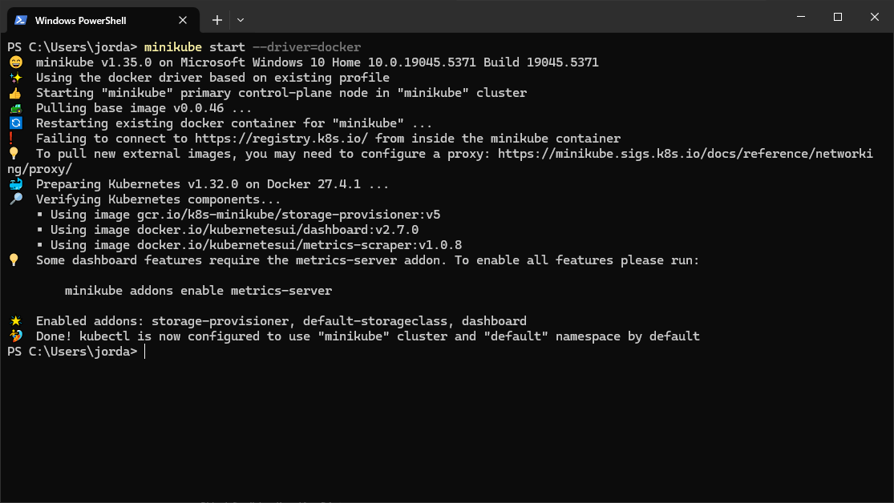
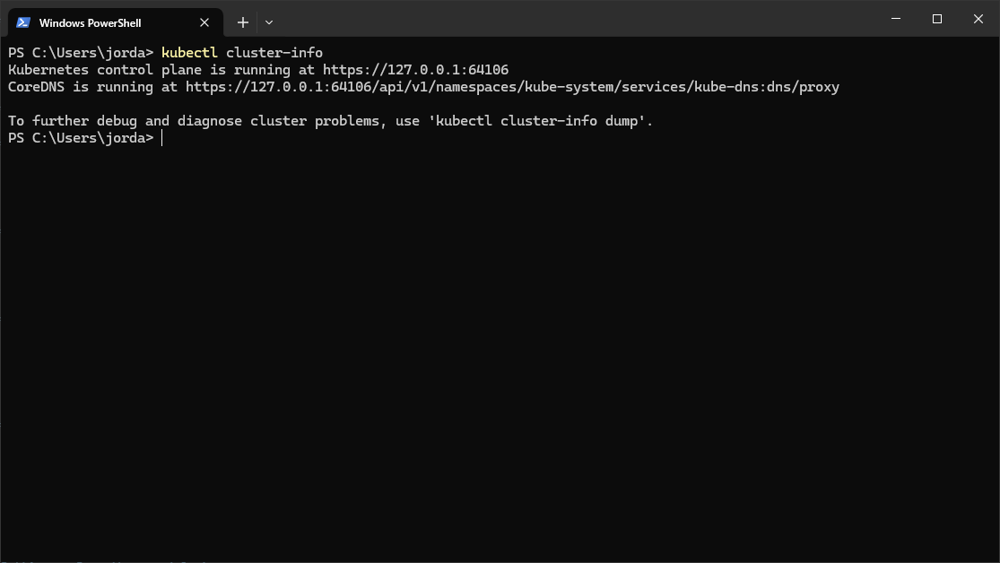
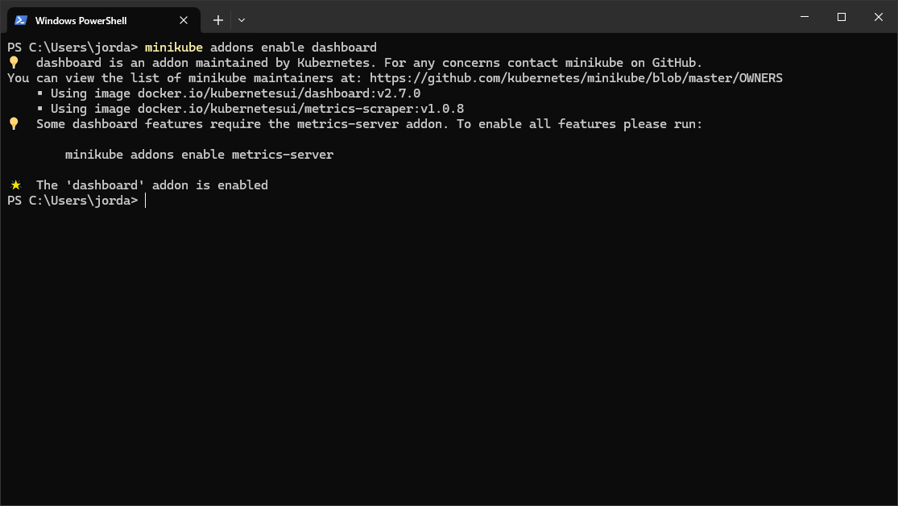

# Setting up the Kubernetes Cluster with Minikube

## My Thoughts

- Minikube is a great way to get started with Kubernetes, I can just focus on gaining an undsetanding of the basics and then move on to more complex topics like CI/CD, etc.
- The CLI is powerful, and makes it very easy to get going. I'm not sure if I'll ever need to use the GUI, but it's nice to have it available.
- The docs are great, and providing you have a basic understanding of the terminal, you can get started quickly.
- The dashboard is a great way to get a feel for the cluster, I'm really excited to see what it can do.
- I'm on Windows, using Windows Terminal, you've got to make sure Docker Desktop is running for the docker driver to work.

## Prerequisites
- Install Minikube: [Minikube Installation Guide](https://minikube.sigs.k8s.io/docs/start/)
- Install `kubectl`: [Kubectl Installation Guide](https://kubernetes.io/docs/tasks/tools/)
- Install Docker: [Docker Installation Guide](https://docs.docker.com/get-docker/)

## Steps

### 1. Start Minikube
```bash
minikube start --driver=docker
```


### 2. Verify Cluster Status
```bash
kubectl cluster-info
```


### 3. Enable Minikube Addons
Enable useful addons like the dashboard:
```bash
minikube addons enable dashboard
```



### 4. Access the Dashboard
Start the dashboard:
```bash
minikube dashboard
```

### 5. Deploy a sample application

This is an example deployment from the Kubernetes docs:

```bash
kubectl create deployment hello-node --image=registry.k8s.io/e2e-test-images/agnhost:2.39 -- /agnhost netexec --http-port=8080
```

## 6. Expose the application

By default, the pod is only accessible from within the cluster, so we need to expose it to the outside world.

```bash
kubectl expose deployment hello-node --type=LoadBalancer --port=8080
```
Since we're using minikube, we use the following command to open a tunnel to the service:

```bash
minikube service hello-node --url
```
This will open a tunnel to the service, and provide a URL that you can use to access the application.